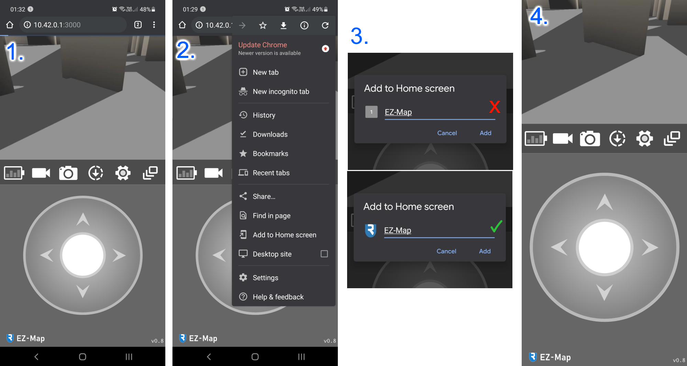
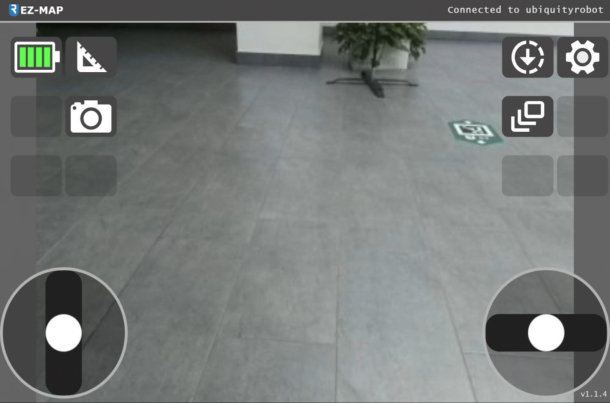
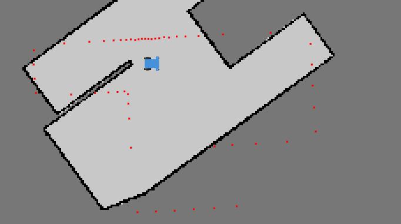
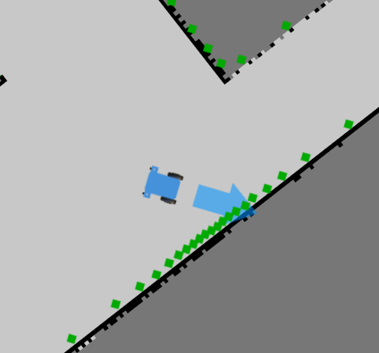
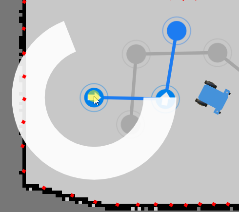
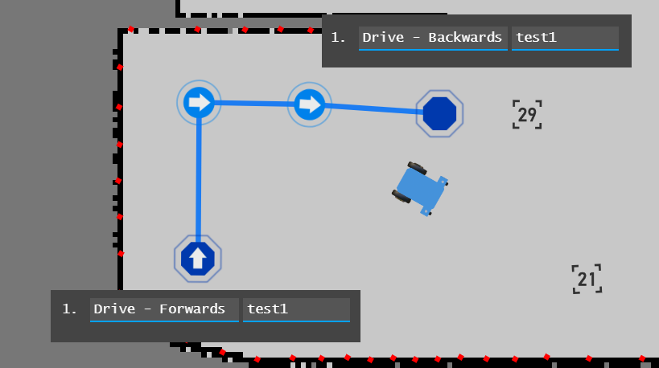
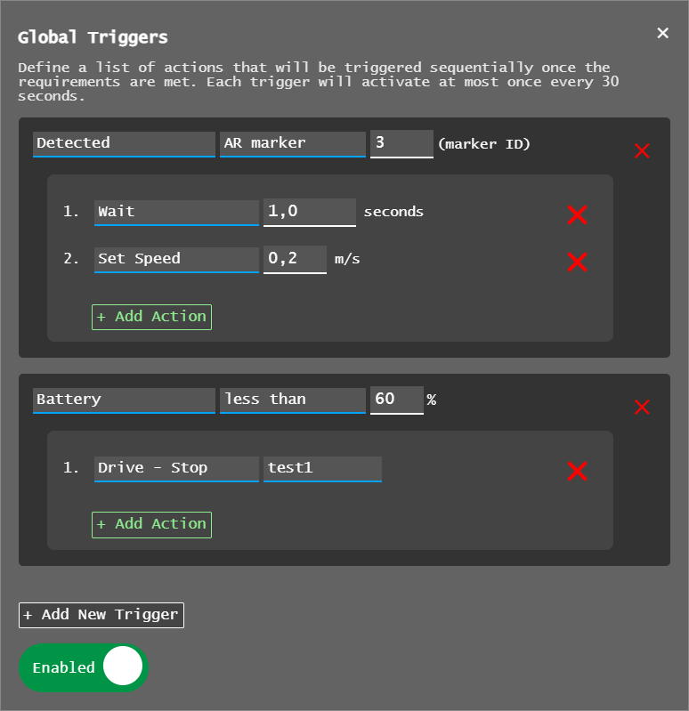
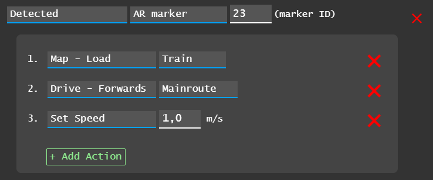

# Getting started

## Connecting to the robot

Connect [to the robot’s access point](kinetic_quick_start_connecting#wifi-hotspot) using a device that supports a web browser. The primary targeted devices are smartphones and tablets since it's easier to follow the robot around with them, however most all common phones, tablets and laptops should work.

**Note: On devices with enabled mobile data transfer, disable it before connecting since the robot’s access point does not provide internet access and as such the mobile device does not route packets to it by default. It is advisable to only connect one device to the robot at a time for best performance.**

## Open the app

Once connected, the webb app should be accessible through the browser by typing in the address: `http://10.42.0.1:3000`.

### Optional: Add to Home Screen

The app can be used straight away, however saving it as a home screen app ② eliminates certain usage issues, so it is encouraged (supported on Android Chrome).

 On certain occasions the required manifest file is not sent ③ which when saved will not launch the full screen setup properly, so repeat the addition (and cancel unless the icon is shown) until it appears properly. 

 The app should then be able to run in full screen ④.

### Initial extrinsics calibration

When the robot first starts you’ll be asked to provide a location and orientation for your sensors, for best results. The process can also be skipped by opening and closing the menu once and can later accessed in the calibration menu ().

## Menus and actions

The app contains a collection of submenus and actions represented by icons that are described in this section. The icons should always be visible somewhere in the app interface, however their size and location differs depending on the screen orientation. Since the design of EZ-Map is modular, these can be added or removed, or you can even write your own custom ones.

 **Window Switch** 

Pressing it swaps the app main views, which are by default the camera video stream and the navigation system.

 **Battery** 

Shows the percentage charge of the robot’s battery, when pressed shows a menu with voltage and percentage values. Note that lead acid batteries should not be deep cycled for best longevity (it's also best to keep them in the range of 50-100%, otherwise system issues can occur due to excessive voltage drops).

 **Calibrations** 

A collection of 3 different setup menus, that allow easy setup of the robot’s lidar, camera and wheels. This should ideally be done before use, to make sure the robot performs as expected.

 **Telemetry/video Record** 

Opens the menu that lets the user record all of the robot’s current internal data as a rosbag file (with an option for AVI video export) to an external USB drive (if plugged in) or onto the sd card. 

 **Photo** 

Takes a photo from the video stream and downloads it through the browser to your device directly. Warning, on some browsers it may override the current tab.

 **Settings** 

Opens a menu for all general robot settings: speed limits, controls, system power, etc.

## Remote control

Assuming the camera is connected correctly, one of the main two screens () should show the video stream from the robot.

The robot can be driven around using the joysticks which show up by default, or you can select alternative control schemes in the settings menu ().

Note, if the battery widget appears as gray ( ), then the MCB and motor node have not yet connected and you may need to wait a few more seconds until the robot is ready to go. If it persists for longer than a minutes or two then it may be an indicator that there's something wrong with the motor control.

## Mapping

To use the robot’s autonomous functions, first switch to the mapping view (). The interface shown should look as follows, the mapping should start automatically:

If the screen shows a checklist of required items that haven't all been checked out, give the system a minute to start or move the robot around slightly so the lidar can gather more data for the initial map iteration. If the message persists for longer it’s likely that the system has not received required data for functioning: i.e. the motor node hasn’t started yet (no battery info) or the lidar hasn’t been connected or configured properly. The checklist should give you an idea of what's missing.

### Map Management 

Clicking the map management icon () opens a dropdown menu where one can inspect the currently saved maps, select one for loading or launch creation of a new map and subsequently save it. Resetting the map will clear the currently displayed version of the map and does not affect saved maps. It will also place the starting point (coordinate 0,0) to the robot’s current location.

It’s possible to switch from SLAM (mapping) to localization only at any time by selecting the bottom slider. When a saved map is loaded it will automatically go into localization mode, so the map is preserved as-is, however you can switch back to mapping to extend existing maps. 

**Note: Maps are not automatically saved, if you want to save changes make sure you save the map again.**

### Landmarks

The hybrid particle filter SLAM also supports landmarks as a way to improve localization accuracy. These are by default set up to be aruco markers that can be printed out and laid out around in view of the camera. Once located with reasonable accuracy they will be implemented into the map and rendered as shown below.

In order to get positional data correct it is crucial to set up the correct camera position. This can be done in the calibration menu ().

### Localizing on a loaded map
When a new map is loaded the robot may not be in the same place as when it was originally when the map was created. As such it may be shown out of position:

To help the system gain a good starting point you can drag and drop the robot to a new location in a way that the red dots align with the black walls. After the robot is dropped an arrow will appear showing the forward direction. On mobile it requires another tap and drag for rotation, while on desktop you just need to move the mouse and click once.

Once the red dots vaguely align with the walls you can let go and the system will localize the robot. Once the robot moves a little it should snap to the map and confirm its position.

## Routes

Clicking the route management icon () opens the route menu window, where routes can be added or deleted and selected. 

**Note: Routes are automatically saved along with a map, if the map isn’t saved the route changes will be discarded on shutdown. If you’re using an existing map the routes will auto-save to the map location.**

### Creating a route

Double tapping anywhere on the map should allow you to add a new goal or prompt you for creation of the first route. Unselected routes of the same map are drawn as greyed out.

Once a route is created and selected you can double click/tap on the map to add and remove new goals. Double tapping on the line between goals should also create a new goal between them. You can of course also drag goals around to make adjustments.

#### Robot Movement

When the route is set, press one of the movement buttons to send the robot forward () or backwards () (opposite the drawn arrows in the UI) along the specified route.

The robot will then first proceed **to the nearest goal** and then follow the route onwards to the last point, where it will stop, unless the route is a loop in which case it’ll continue driving until stopped.

If the robot is in motion one of the previous two buttons will change to stop icon (), and pressing it will stop the robot and cancel the route.

### Goal Actions

When you have a route set up, the next step is to define actions executed upon reaching a goal. Hold down the mouse/finger on a goal until the Actions menu appears.

As the robot arrives at the specified goal it will then check the defined actions and execute them sequentially one after the other:

In this case the robot would:
* wait for one second
* set the movement speed to as fast as possible
* execute a speech to text command on the robot (requires a speaker)

 The goal should then change colour and shape to indicate stored actions.

The command line functionality should allow for running custom scripts at specific points in the route or sending data to other parts of the system.

### Looping

There are currently two ways to create perpetual driving. The first one is simply moving the first and last goal together (requires a minimum of 3 goals)

The route will then turn purple to indicate successful looping.

**Note: As the first and last goal are joined together only the first goal will execute it’s defined actions (as the last goal is never processed).**

Another way to do so is to create so called ping-pong looping, which is to set the first and last goal to trigger the route in opposite ways using actions:

The robot should then drive the route one way, then reverse and return to the start, and continue forward again. By removing the “Forward” action we also get go-and-return behaviour for example. There are further possible combinations by setting the drive commands to other routes, which lets you chain different routes together.

### Locking

In case of small devices, it may be easier to lock the positions of goals so they are not accidentally moved when setting up actions. The route management menu has an option labelled [🔒 Lock Goal Movement] which will globally lock route editing until you turn it back on.

## Initialization Triggers

*Note: Still a work in progress, may not behave completely reliably yet and is subject to change.*

The global triggers menu () lets you set a string of actions that will be executed once the set conditions are met. The actions are much the same as the ones you can set on specific goals, however they will be triggered globally by some sort of event instead of the robot arriving at the goal. The functionality can be enabled or disabled in order to easily set up and reset the cooldown timers of triggers.

In this example we see that the executed actions will be the following:
* upon spotting the aruco marker number 3, the robot will wait 1 second and then slow down movement
* if the battery drops below 60% the robot will stop route driving

Triggers (and actions) are web app independent, so they will run in the background regardless of it running in a browser.

Another example below will load a saved map upon seeing marker 23, then start a predefined route on the map at max speed:

Such a setting should allow for driving a robot using remote control into a room so it sees the marker, upon which it takes over and runs the automated route.

At present time the robot DOES NOT do global initial localization, so it should be rotated and positioned as close to the map’s starting point / origin as possible for best results.