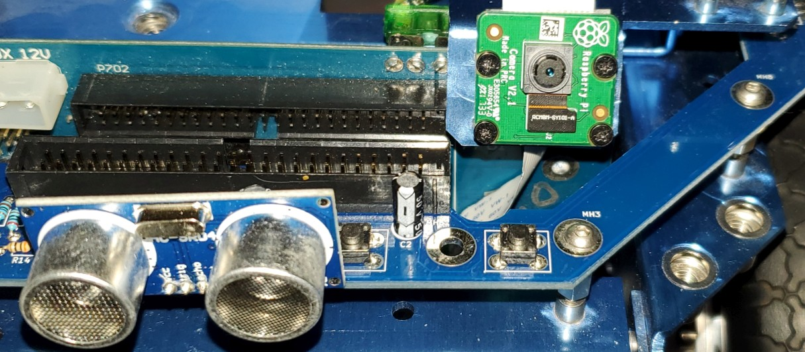
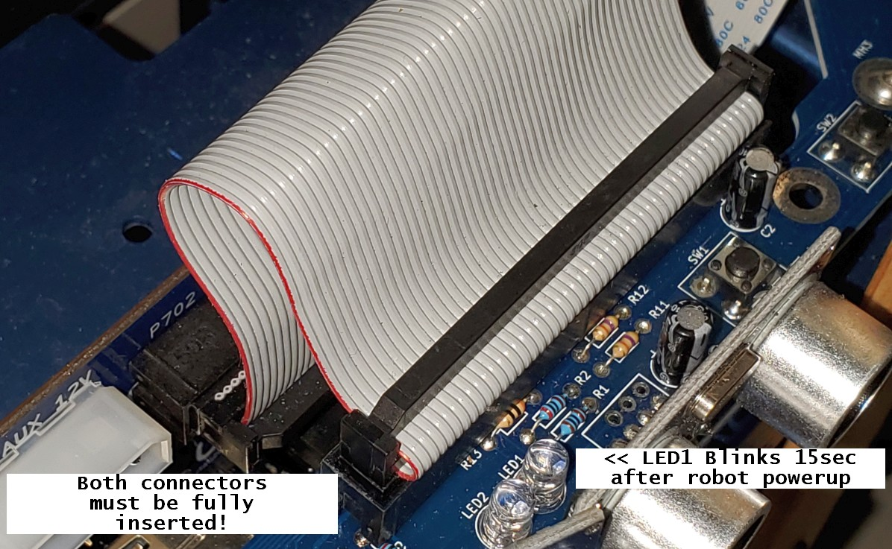

---
title: "Sonars"
permalink: kinetic_magnisilver_sonars
group: "magni silver (gen 5)"
rosver: kinetic
nav_order: 7
nav_exclude: false
--- 
# Sonars

<H4 style="color:red">When changing out sensors makes sure to disconnect the RED battery cable from the batteries and wait 2 minutes so high voltage and current are not linked with the main board!</H4>

The picture below shows the Raspberry Pi camera in the **forward** orientation and the cable to the Sonar board included with Magni Silver. This is a very popular configuration for Magni.


## Attach and Enable The Sonar Board

Below is a picture of the Sonar board included with Magni Silver configuration. This section will show how the Sonar Board is mounted on tall standoffs and a 50-pin ribbon cable is then attached. The sonar board is included in the large box for a Magni Silver but is not attached to the robot prior to shipment.  Be careful to avoid the need to often re-bend the sonars if they bump something because the pins can only be bent and re-bent a limited number of times.


## Enable Sonar Board To Run in robot.yaml file

The Magni software must be configured to enable usage of the sonar board. You must edit the
`robot.yaml` file as root user then modify the file.   

`sudo nano /etc/ubiquity/robot.yaml`

Make an edit so the only uncommented line with `sonars:` in it is as shown below.
Be sure to edit the line with  `sonars: none` so the line starts with a pound sign and is thus a comment.    

Remove the ```#``` from the line that will enable the sonar software and note there must be a space after the colon or it will not work.

`sonars:  'pi_sonar_v1'`


## Verification Of Sonars Operating

Once the sonars are enabled to run in the robot.yaml file you can reboot the robot and verify the sonars are running with a simple command.

In a SSH console session to the robot after the robot has fully started (can take a minute) type ```rostopic hz /sonars```
If the Sonars are working then you will see a periodic messaage repeat with a rate that the sonar messages are being received.

You can also use  ```rostopic echo /sonars``` which if the sonars are running will scroll a great deal of messages so hit Control-C to stop the messages and when you scroll back the window you should see over and over all 5 sonars showing their range.

The most common reasons for this not to work are as follows:
* Sometimes we see the customer has not fully inserted the 50 pin ribbon cable going from the MCB to the sonar board.  Be sure to hutdown and power off the robot and disconnect the fat red battery before trying to check for this condition.
* The line in the robot.yaml file is not quite right with the most common issue being the lack of a space after the `sonars:`  as there must be a space before the rest of the line.
* We have had a standoff put below the middle of the board due to a manufacturing error.  In a section just below this is discussed so check for this case.
* For Raspberry Pi 4 boards we have found and fixed a problem in the GPIO drivers that prevents sonars from working.  See the next section below for details.

### Raspberry Pi 4 Issues With Sonar board

We have found serious issues with using a Raspberry Pi 4 in combination of the Sonar board.  These come from fundamental architectural changes in how the GPIO lines are implemented on the Pi4.  

If your unit has a Pi4 then this fix is required for Images we supply up through 2020. This is a very high priority issue.  Certain workarounds had been found in mid 2020 but they seem to no longer work.   If your raspberry Pi is a Pi 3 you do not need to do this nor should you do this process!

Here is what must be done to make the Sonar board work with a Raspberry Pi 4 CPU.  
Obtain and burn a fresh image using our 2020-11-07 image located on our [Download Page](../../assets/camera_sensor/https://downloads.ubiquityrobotics.com/pi.html)

To do this fix you will need to have the Magni connected to your own Wifi so that the robot can gain access to the internet and apply these fixes.  You would use an SSH session to the robot and to assist in that setup see this page:
[Connecting the Robot to Your Network](../../assets/camera_sensor/https://learn.ubiquityrobotics.com/connect_network)

We will fix this in a new image as soon as possible as a high priority but until then this is the process.

From an SSH session to the robot that has internet access use these commands

    sudo systemctl stop magni-base
    cd catkin_ws/src
    git clone https://github.com/UbiquityRobotics/pi_sonar
    cd pi_sonar
    git checkout daemon_pigpio
    cd ~/catkin_ws
    catkin_make               (This will take a couple minutes)
    sudo systemctl enable pigpiod
    sudo shutdown -r now      (This will reboot the robot)

You may now setup the robot to enable the sonar board as part of our normal sonar board install that continues below


## The Sonar Board Is Mounted To The Robot With standoffs

The Sonar board is mounted to the chassis using just 4 standoffs.  Only the two standoffs to the sides that will have large pads with holes on the sonar board for 3mm standoffs are to be used. This description will show the 2 standoffs
on the right but two other standoffs on the left also at the 45 degree angle are
used as well.

<H4 style="color:red">If you get your robot with a standoff screwed into the front top bar of the robot in the middle location REMOVE THAT STANDOFF because it will cause a SHORT CIRCUIT to parts in the middle of the Sonar board. The middle standoff is used ONLY for a board that sits below the Sonar board</H4>


The standoffs and the M3 screws are shown below for reference.


The 4 standoffs screw into the fixed nuts on the chassis. The picture below shows the 2 standoff locations on right and the 2 on the left.  Center standoff is NOT used.

There is also no need to load the large fuse on the back of the board for just the Sonar board and we recommend removing F701 if it is loaded for when you only have the Sonar board (Up to 2020 that was always the case).  The fuse allows 24V to get routed to other boards that sometimes can sit below the sonar board but it is best safety to just remove that fuse.


Below is shown the right side of the sonar board fully mounted using the M3
standoffs and M3 screws from the top.



The ribbon cable is then inserted into the main Magni board as shown in the
picture below where it will be plugged into the Sonar board as the final step.


Be sure the 50 pin ribbon cable is fully inserted into both the main Magni board as well as the Sonar board.  It can be held up due to being tight or having bent pins.   Notice how far they should go into the jacks, about 5mm or so, as shown from the side in the picture below and also shown as first picture on this page.



LED1 is for the wifi but if you do not see that start to blink within around 15 seconds after a fresh power up case there may be something not connected on the 50 pin cable.

Lastly attach the cover plate with 6 M6 screws using an M4 Allen wrench. You are
done, hooray!